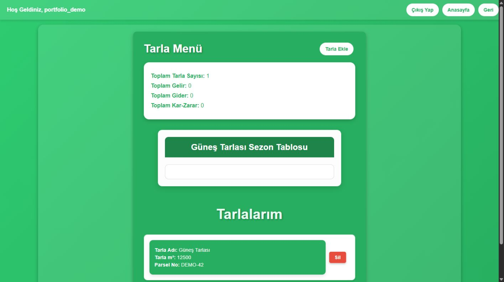
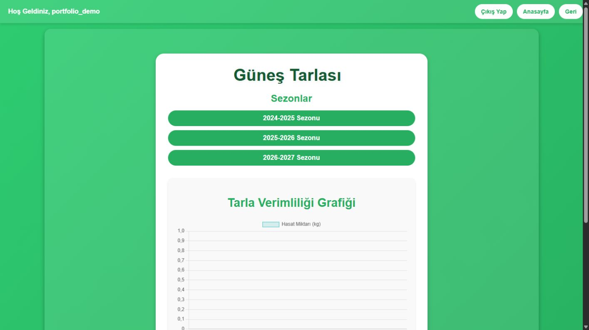
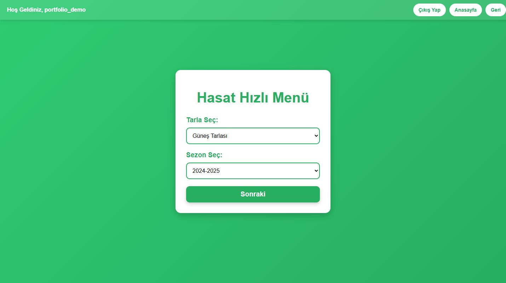

# Farm Finance Tracker

Tarla ve sezon bazında tarımsal gelir, gider ve kâr/zarar takibi yapan Flask uygulaması. Birden fazla tarlanın kayıtlarını tek hesapta yönetmeye yönelik bir öğrenme projesidir.

## Özellikler

- Hesap oluşturma ve oturum açma
- Tarla, parsel ve sezon kayıtları
- Hasat, destek, yakıt, gübre, tohum ve diğer gelir/gider kalemleri
- Tarla bazında ve genel kâr/zarar özeti
- Kullanıcıların yalnız kendi tarlalarını değiştirebilmesi

**Teknolojiler:** Python, Flask, SQLite.

## Ekran görüntüleri

| Tarla özeti | Tarla detayları | Yeni kayıt |
| --- | --- | --- |
|  |  |  |

## Yerel kurulum

```bash
python -m venv .venv
source .venv/bin/activate
pip install -r requirements.txt
```

Windows'ta sanal ortamı `.venv\Scripts\activate` ile açın. Oturum anahtarını `FLASK_SECRET_KEY` ortam değişkenine atayıp `python app.py` çalıştırın. PowerShell örneği:

```powershell
$env:FLASK_SECRET_KEY='yerel-ortam-icin-rastgele-bir-anahtar'
python app.py
```

Uygulama: `http://127.0.0.1:5500`. Veritabanı ilk çalıştırmada oluşturulur. Testler: `python -m unittest discover -s tests -v`.

**Durum:** Arayüz, ilk ders projesindeki yapıyı koruyor. Kimlik doğrulama ve kurulum daha sonra iyileştirildi; bazı kategori işlemlerinde yinelenen kod bulunuyor.

## Lisans

MIT.
